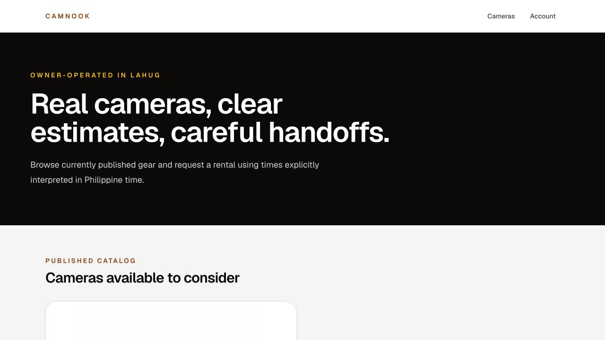
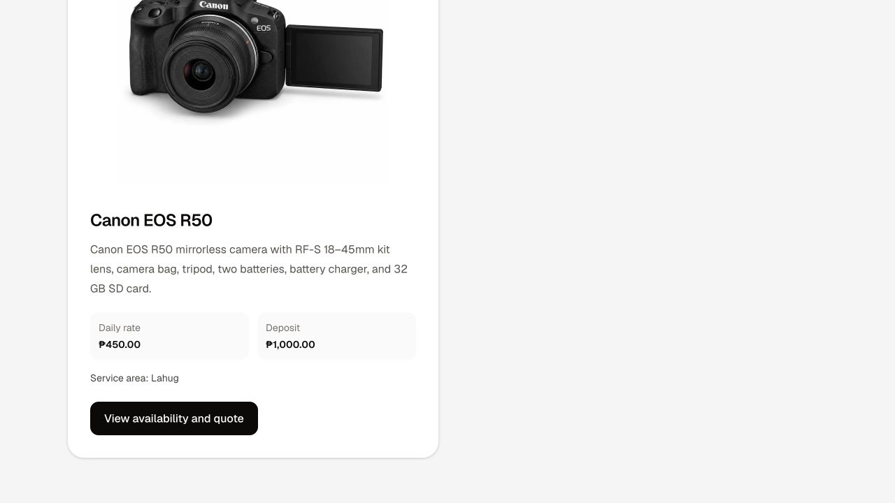
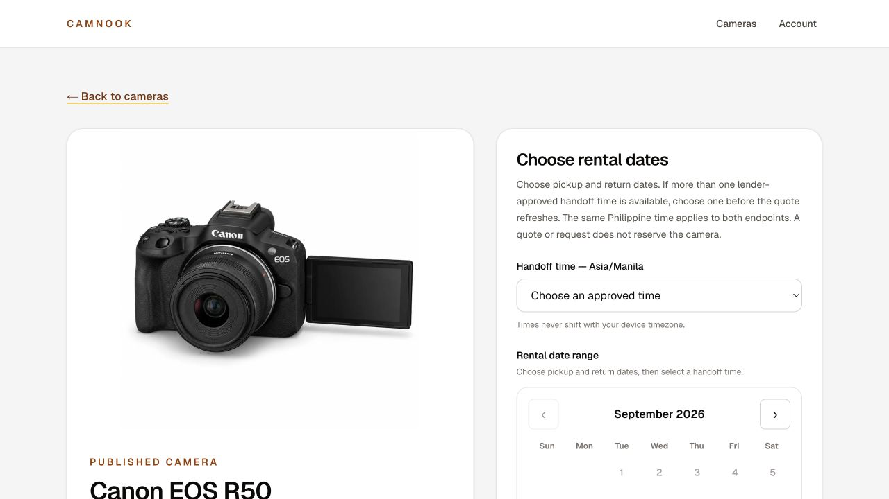
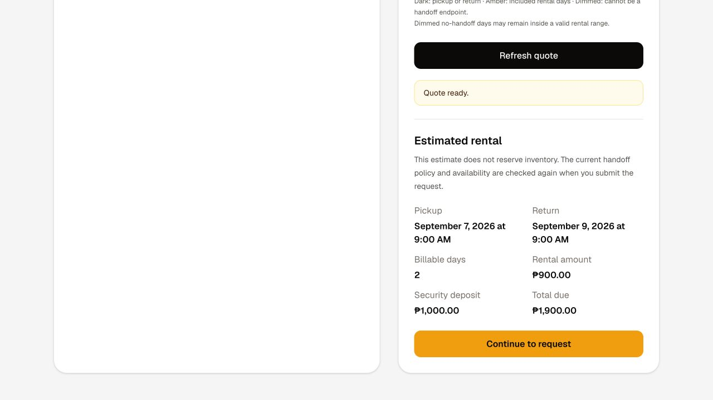
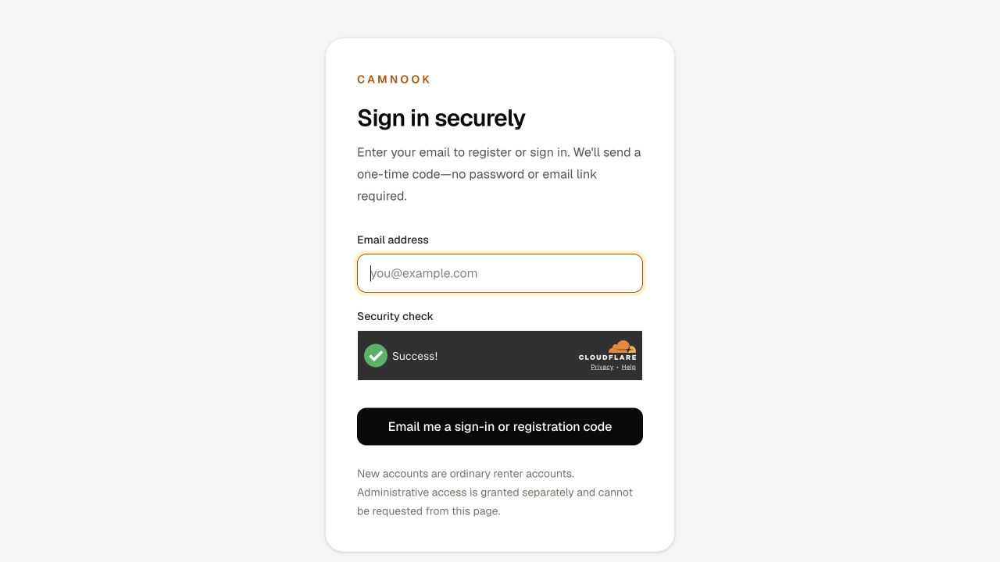

# CamNook core user-flow audit

Date: 2026-09-04
Scope: renter booking and owner listing
Mode: combined UX and accessibility-risk audit
Evidence: current production UI at `https://camnook.shop` plus the current application route/component tree

## Overall verdict

Renter booking has a trustworthy public discovery and quote experience, but the request path becomes too long and conditional after the quote. Owner listing is not a complete user flow: the current owner/admin surface is an operations console, with only a handoff-policy editor for an already-existing camera. There is no owner-facing inventory, create/edit listing, media/inclusions editor, preview, or publish path.

The highest-leverage simplification is to make the product visibly support two short jobs:

1. Renter: choose camera -> choose schedule -> identify/contact + meetup area -> review and request.
2. Owner: inventory -> listing basics/media -> availability/handoff -> preview and publish.

## Captured renter flow

### 1. Catalog entry — Healthy

The value proposition is clear, the location is stated, and the navigation is small. The first camera is below the initial desktop fold, so the page opens on brand copy rather than immediately advancing the booking task.

### 2. Camera selection — Healthy, with excess vertical travel

Rate, deposit, service area, and a single clear action are present. The large image/card height means the decisive pricing and CTA require substantial scrolling even with only one listing.

### 3. Camera details and schedule — Needs simplification

The product photo, inclusions, price, deposit, calendar, timezone, and accessible day labels are strong. The instruction says to choose dates and then a handoff time, but the handoff-time control appears first and must be chosen first. That mismatch makes the task harder to learn.

Observed state problem: after the quote became ready, the handoff-time dropdown visually returned to “Choose an approved time,” while the selected-schedule summary still showed `9:00 AM PHT`. This creates contradictory visible state.

### 4. Quote review — Mixed

The full cost is explicit and easy to scan. However, a full-width “Refresh quote” action remains visually dominant above the ready quote, while “Continue to request” sits below it. The page repeats that the quote does not reserve inventory several times. The result feels more cautious than decisive.

### 5. Sign-in / registration interruption — Needs simplification

Passwordless email is clear and the return URL preserves the quoted schedule. But the user hits authentication only after selecting dates, time, and reviewing price. This is acceptable if state preservation is perfect, but it is still a high-risk abandonment point. The page also exposes an administrative-access explanation that is irrelevant to a renter trying to finish a booking.

### 6. Profile prerequisite — Needs simplification; code-inspected, not visually verified

After authentication, a first-time renter must save legal name and phone before the request form appears. This is reasonable data, but it is implemented as a separate prerequisite/save cycle rather than part of one guided booking continuation.

### 7. Meetup and request details — High friction; code-inspected, not visually verified

The request form can ask the renter to choose among saved area, device location, typed city, Philippine area hierarchy, public venue recommendations, a radio selection, a confirmation checkbox, intended use, and expected shooting location before submission. This is much more work than the basic job “request this camera for these dates.”

For the initial request, ask only for a broad meetup area plus concise purpose/location. Defer exact public-venue recommendation and confirmation until after owner approval, when both parties know the request is viable.

### 8. Submit and track request — Implemented, not reached

The account and booking-detail routes show persisted status, owner-review expectations, contract, payment, pickup, return, and resolution states. The single booking-detail page is comprehensive but can become a long operations record. Progressive status cards should expose only the current action and keep completed/future stages collapsed.

## Captured owner flow

### 1. Owner entry — Blocked / not discoverable

There is no public “List your camera” or owner entry point. Direct `/admin` navigation uses the same renter-oriented sign-in page, which says new accounts are ordinary renter accounts and administrative access cannot be requested there. That is suitable for a private sole-admin console, but it is not an owner-listing journey.

### 2. Owner authentication — Blocked in this audit

An authorized production admin session was not provided, so authenticated owner screens were not captured. The current route tree was inspected to identify available owner capabilities.

### 3. Owner operations — Partial

The admin navigation provides Action needed, All queues, Settings, and Reports. These support booking operations, payments, handoffs, and reporting. They do not provide a listing inventory or a “Create listing” task.

### 4. Inventory/listing management — Missing

There is no owner-facing route for listing inventory, new listing creation, listing basics, pricing, description, inclusions, photos, edit, archive, or status management. Camera records and publication functions exist in the data layer, but the product flow does not expose them.

### 5. Availability and handoff — Partial

An existing camera can reach `/admin/cameras/[cameraId]/handoff` from Settings. That screen manages a barangay-level routing origin, weekdays, approved handoff times, and enablement. It is a useful listing sub-step, but it is isolated from a complete listing workflow and uses implementation-heavy language such as policy version, PSGC reference, and canonical origin.

### 6. Preview and publish — Missing

The database has guarded camera-publication behavior, but there is no owner-facing preview/readiness checklist or publish action. The owner cannot complete the basic listing job through the app.

## Highest-impact gaps

| Priority | Gap | Why it blocks the basic job | Recommended change |
|---|---|---|---|
| P0 | Owner listing flow is absent | Owners cannot create or publish a listing in the product | Add Inventory, Create listing, Edit listing, Preview, and Publish routes |
| P1 | Initial renter request requires too many location decisions | A simple request expands into provider location, area hierarchy, venue selection, confirmation, purpose, and shooting location | Ask for broad meetup area during request; defer venue selection until approval |
| P1 | Schedule instructions and control order conflict | The page says dates first but requires time first | Select dates first, then show valid handoff times |
| P1 | Quoted handoff time visually resets | The dropdown and schedule summary disagree | Keep the selected value visible and make the quote state single-source-of-truth |
| P1 | Manual refresh competes with Continue | The user sees two full-width actions after the quote is already ready | Auto-refresh silently and keep one primary Continue action |
| P2 | First-time profile is a separate save cycle | It interrupts the booking continuation | Inline name and phone into the booking step and save them on request submission |
| P2 | Owner tools use system language | “Authorized sole admin,” policy versions, canonical anchors, and PSGC references describe implementation rather than the owner’s job | Use listing language: Pickup area, Available days, Handoff times, Save availability |
| P2 | Booking detail can become one long record | Current action can be buried among contract, payment, pickup, and resolution sections | Show a current-step card and collapse completed/upcoming stages |

## Recommended target flows

### Renter booking

1. Browse cameras and compare total starting price.
2. Pick dates; then pick one valid handoff time; show total immediately.
3. Continue with passwordless sign-in and inline name/phone if needed.
4. Confirm broad meetup area, purpose, and shooting city; review and submit.
5. After approval, confirm exact public venue, contract, and payment from a focused next-action screen.

### Owner listing

1. Open Inventory and choose Add camera.
2. Enter name, description, daily rate, deposit, inclusions, and photos.
3. Set pickup area, available weekdays/times, and blocked dates.
4. Preview the renter-facing listing and fix readiness issues inline.
5. Publish; return to Inventory with status and booking activity visible.

## Accessibility observations

Confirmed strengths from the captured UI and DOM include semantic landmarks/headings, descriptive image alt text, explicit form labels, live status messaging, keyboard-focus styles, and 44px-class targets for calendar and navigation controls. Calendar days expose selected/available/disabled meaning in accessible names rather than color alone.

Risks to verify:

- The visual calendar key relies heavily on dark, amber, and dimmed states; test non-color indicators and contrast in all states.
- Confirm the contradictory handoff-time reset is announced correctly to screen readers and does not move focus unexpectedly.
- Test keyboard-only date-range selection, month changes, quote updates, and return from OTP.
- Test Cloudflare Turnstile with screen readers and keyboard navigation.
- Test responsive reflow and 200% zoom; this run used a 1280 x 720 viewport.

This is not a WCAG conformance claim.

## Evidence limits

- Production was audited without creating a real renter account or sending an OTP.
- An authenticated authorized-owner session was not available.
- Authenticated steps are therefore based on the current route/component implementation rather than accepted screenshots.
- The local app could not render without Supabase environment values, so the current production deployment was used for visual evidence.
- No booking request, owner action, payment, publication, or other production mutation was submitted.
