# CamNook end-to-end UX audit and user-flow redesign

Audit date: September 4, 2026
Live source of truth: <https://camnook.shop>
Perspectives: first-time customer, authenticated customer, sole admin
Method: live browser interaction, current-state DOM inspection, and freshly captured screenshots. No production records or settings were changed.

## 1. Executive Summary

CamNook has a strong safety and trust foundation: prices are explicit, the timezone is named, government ID is checked in person rather than uploaded, booking approval is transactional, and money/deposit transitions are described conservatively. The visual language is consistent and the markup exposes useful headings, labels, regions, statuses, and accessible calendar names.

The product is not currently operationally coherent end to end. The highest-impact problem is that customers can browse a published camera and obtain a valid quote, but cannot complete the booking request because both tested meetup-location paths fail. At the same time, the admin has two overdue requests that cannot be approved because no active contract template exists and an authoritative quote cannot be obtained. GCash is also not configured. The system therefore accepts or retains demand that the operator cannot progress.

The biggest customer-flow problems are:

1. Meetup selection blocks submission after the user has already invested in choosing dates, quoting, and signing in.
2. Three competing location methods plus a separate “expected shooting location” create excessive decisions and repeated location concepts.
3. Internal status language such as `FOR_REVIEW` is exposed instead of a plain-language state and next step.
4. Public geography is inconsistent: the catalog says “Owner-operated in Metro Manila,” while the current camera schedule shows a Cebu City meetup area.

The biggest admin-flow problems are:

1. Published inventory is not gated by complete operational readiness. Missing contract, payment, location, and quote dependencies surface after requests already exist.
2. The admin home mixes payment configuration, camera policy, nine operating queues, deposit reconciliation, compliance, and portfolio analytics in one long page.
3. Review blockers describe what is wrong but do not provide a direct resolution path.
4. Handoff times are maintained in a free-form text area, and the camera still uses a legacy city-only origin.

The most important change is an **operational readiness gate**: a camera must not be publicly requestable until its handoff origin, schedule, active contract template, authoritative quote path, and enabled payment method all pass one visible admin checklist. If a dependency later fails, preserve browsing but stop new requests before customer effort is spent, with a clear availability message.

## 2. Product Flow Map

### Customer

| Workflow | Goal | Entry point | Completion point |
| --- | --- | --- | --- |
| Browse catalog | Find rentable gear and understand base cost | Cameras `/` | Camera detail |
| Check availability and price | Choose a valid period and know total due | Camera detail | “Estimated rental” quote |
| Sign in / register | Continue securely without a password | “Continue to request” or Account | OTP-authenticated return to the intended route |
| Submit rental request | Confirm meetup details and send a request | Authenticated new-booking form | Persisted request in `FOR_REVIEW` *(not completed; production submission intentionally avoided and the form was blocked)* |
| Manage profile default | Reduce repeated location entry | Account | Saved canonical meetup origin *(save not performed)* |
| Track booking | Understand status and history | Account → booking card | Booking detail/timeline |
| Request cancellation review | Ask admin to review cancellation | Booking detail | Cancellation-review request *(not submitted)* |
| Read identity policy | Understand pickup ID requirements | Account | Government-ID privacy notice |

### Admin

| Workflow | Goal | Entry point | Completion point |
| --- | --- | --- | --- |
| Triage operations | See work requiring attention | Admin `/admin` | Relevant queue/record |
| Review booking request | Approve or reject safely | Booking review queue | Contract-pending or rejected booking *(not mutated)* |
| Configure handoffs | Set private origin, public city, days, and times | Camera policy link | Saved policy version *(not saved)* |
| Configure GCash | Enable manual payment instructions | Admin home | Live recipient configuration *(not saved)* |
| Reconcile deposit liability | Check held and refundable amounts | Admin home | Reconciled understanding; record mutations live in booking flows |
| Monitor lifecycle queues | Process signature, payment, pickup, active rental, return, issue, and refund work | Admin queue summary | Updated booking state *(queues were empty, so deeper flows were unavailable)* |
| Review portfolio | Check revenue, utilization, and cost recovery | Admin home date filter | Updated reporting period *(filter not applied)* |

## 3. Evidence and Flow Steps

### Customer flow

1. **Catalog — healthy, with a trust inconsistency.** The camera, inclusions, rate, deposit, and primary action are immediately clear. The “Metro Manila” positioning conflicts with the camera’s later Cebu City meetup area.

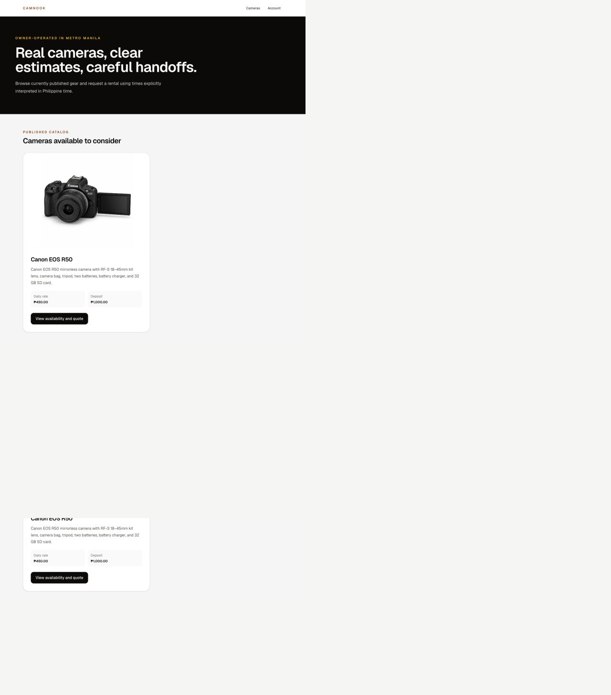

2. **Availability entry — mostly healthy.** The page explains that the same Philippine time applies at both endpoints and that a quote does not reserve inventory. Requiring time before dates disables the entire calendar and adds an avoidable decision before the customer can express their date need.

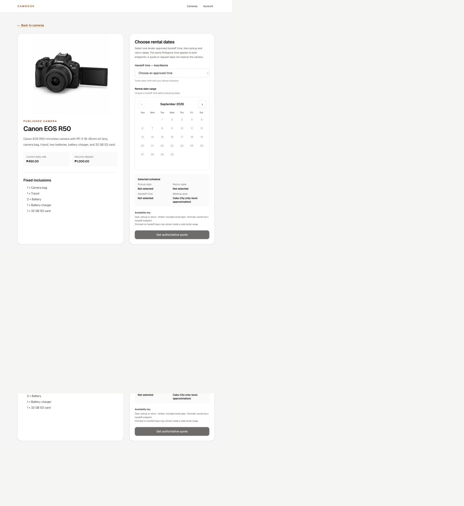

3. **Schedule selected — healthy.** Pickup, included days, and return have distinct visual states and rich accessible button names. The selected schedule summary repeats the important values.

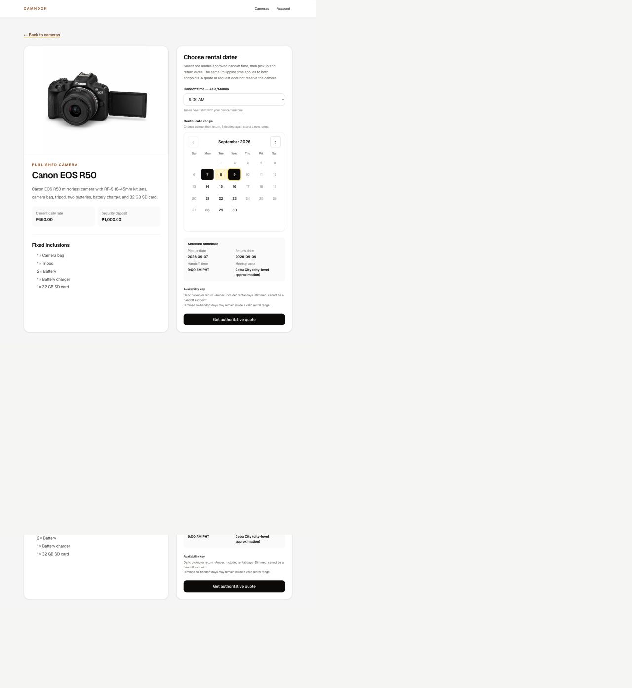

4. **Quote ready — mostly healthy.** Cost composition is clear and the next action is prominent. After quoting, the handoff select visually returns to “Choose an approved time” even though the selected schedule and quote still say 9:00 AM; this creates contradictory state.

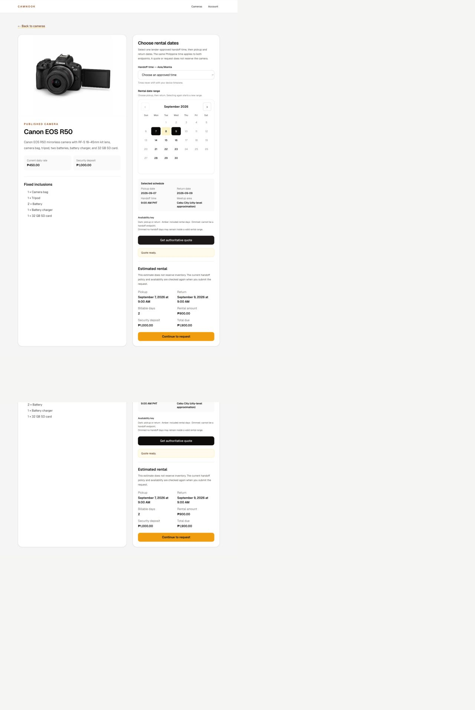

5. **Sign in — healthy but interrupts conversion.** Passwordless email OTP and the security check are understandable. The intended booking route is preserved in the URL, which reduces loss of work. OTP delivery and return were not retested because sending a code was outside the non-mutating audit.

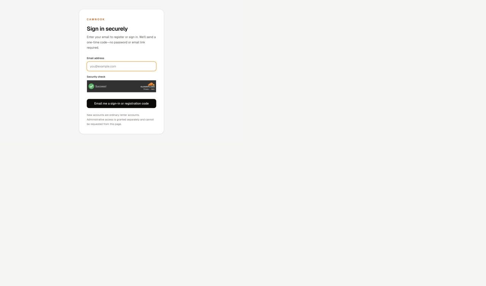

6. **Authenticated request form — high friction.** The quote is repeated accurately, but the meetup section presents device location, free-text city suggestions, and a four-level canonical address form at once. “Expected shooting location” then asks for another location concept.

7. **City fallback error — unhealthy.** Entering the generic city “Cebu City” and requesting suggestions returned only “A public meetup recommendation is unavailable right now. Retry before submitting.” No alternative suggestion, diagnostic detail, or bypass appeared.

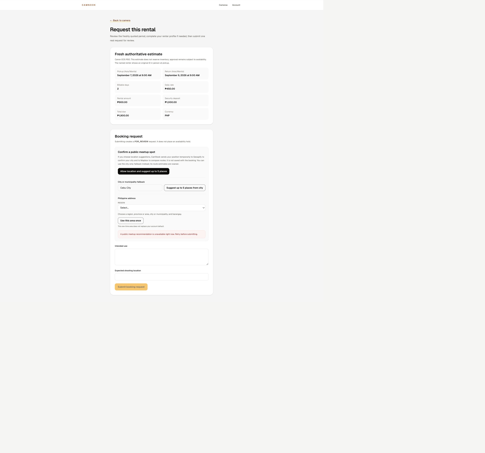

8. **Manual fallback recovery — critical failure.** Selecting Region VII → Cebu → City of Cebu → Lahug and choosing “Use this area once” also failed. The four dropdowns visibly reset to placeholders while the status still said “Barangay selected,” and submission remained disabled.

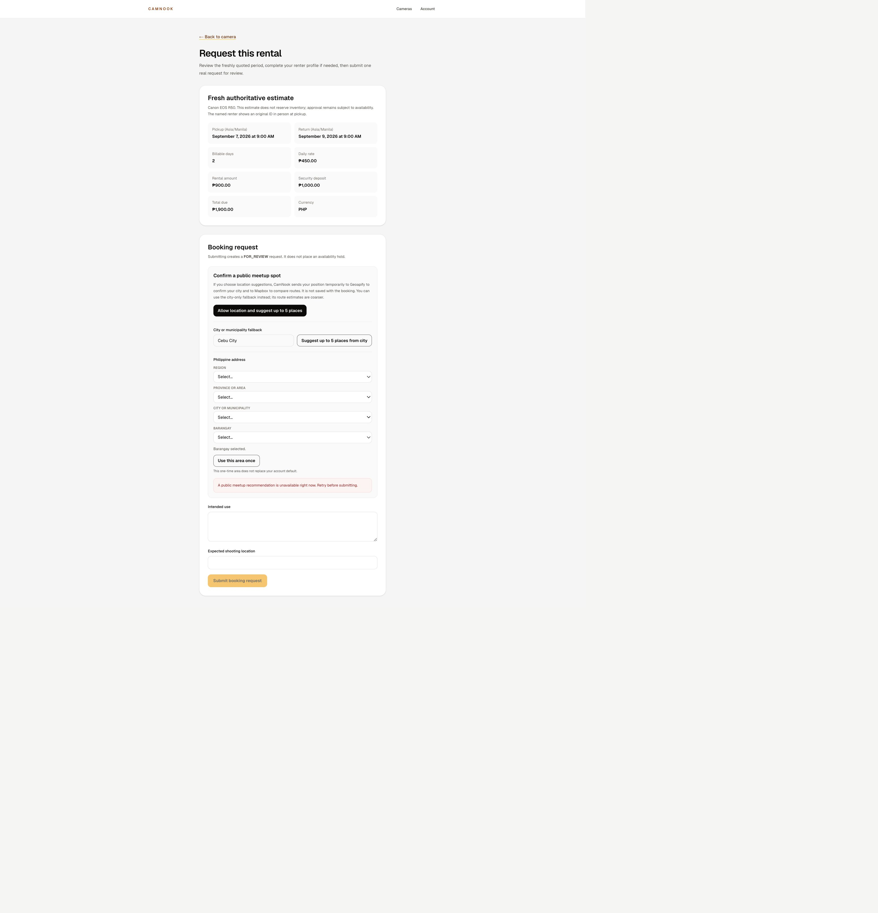

9. **Account — mostly healthy.** Identity policy, booking history, and profile defaults are grouped clearly. Saving a default still requires Region → Province/Area → City/Municipality → Barangay, and checkout promises to ask for confirmation again.

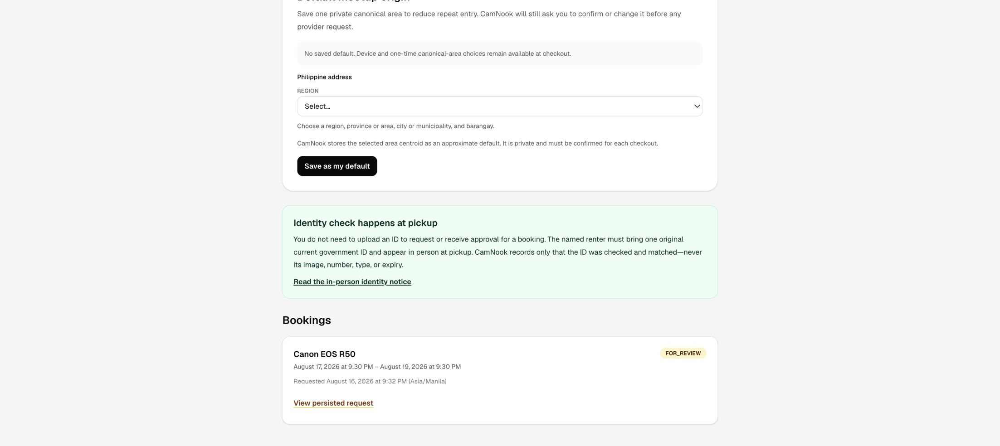

10. **Booking status — needs clearer language.** Dates and non-reservation policy are visible, but `FOR_REVIEW` is an internal enum. The page does not state an expected admin response time or a customer-oriented next step.

### Admin flow

11. **Operations dashboard — structurally overloaded.** It provides a useful, database-backed snapshot, but setup, nine queues, liability reconciliation, cancellation, and portfolio analytics form a very long single page. The two requests are already overdue.

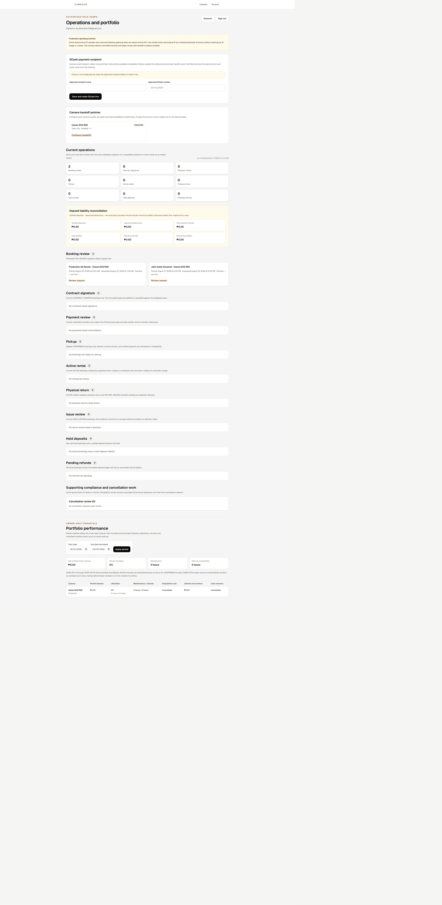

12. **Camera handoff policy — functional but error-prone.** Weekdays are easy to toggle, but times are a free-form multiline field. The page reports a legacy Cebu City origin while the public brand says Metro Manila. Copy referring to a “dependent calendar feature” is stale or unclear because renters can already use the public calendar.

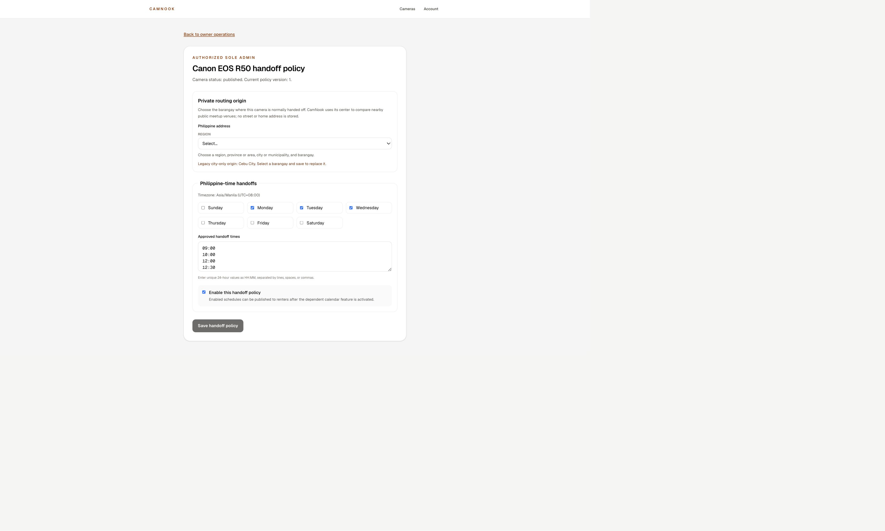

13. **Booking decision — safely blocked, poorly recoverable.** The UI correctly prevents approval and identifies two unmet conditions. It gives the admin no direct link or action to activate a contract template or repair/retry the authoritative quote. Rejection remains available, turning a system-readiness failure into a renter-facing outcome.

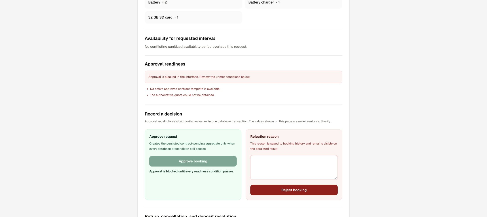

## 4. UX Findings

### F1. Published inventory cannot complete the primary booking flow

- **Workflow:** Customer request submission
- **Observed behavior:** City suggestions failed. The four-step manual canonical address path also failed, reset the visible selections, retained the contradictory “Barangay selected” status, and kept submit disabled.
- **Problem:** There is no working completion path from a valid quote to a booking request.
- **Why it creates friction:** The failure occurs after the customer has selected gear, time, dates, reviewed a quote, and signed in.
- **Severity:** **Critical**
- **Evidence:** Steps 6–8; screenshots 11–13.
- **Root cause:** Exact technical cause was not visible in the UI or console. The observed product-level cause is that meetup recommendation is a hard dependency for submission and both exposed recovery paths depend on the same failing outcome.
- **Recommended change:** Make canonical area selection itself sufficient to submit, with venue suggestions optional and recoverable. Preserve selections on failure, explain what remains usable, and provide a retry that does not clear state.

### F2. Operational readiness is checked too late

- **Workflow:** Customer request → admin approval
- **Observed behavior:** The camera is published and accepts quotes, yet admin review is blocked because there is no active approved contract template and an authoritative quote cannot be obtained. GCash is also not configured; two requests are overdue.
- **Problem:** Public requestability is decoupled from the dependencies needed to fulfill a request.
- **Why it creates friction:** Customers can enter a dead-end queue; admins can only reject requests caused by system configuration gaps.
- **Severity:** **Critical**
- **Evidence:** Steps 1–4, 11, and 13.
- **Root cause:** **Inferred:** publication and request admission do not share one readiness gate covering contract, payment, quote, and handoff configuration.
- **Recommended change:** Add one per-camera readiness checklist and gate requestability on it. Show the failing dependency and resolution link in both the dashboard and review record.

### F3. Public service-area messaging contradicts operations

- **Workflow:** Browse → schedule → meetup
- **Observed behavior:** The catalog says “Owner-operated in Metro Manila”; the selected schedule says “Meetup area Cebu City (city-level approximation)”; admin policy calls this a legacy city-only origin.
- **Problem:** Customers cannot confidently tell where handoff will happen.
- **Why it creates friction:** Location feasibility is a core rental decision and is learned only after entering the camera flow.
- **Severity:** **High**
- **Evidence:** Steps 1–4 and 12.
- **Root cause:** Directly observed legacy camera origin plus separately authored catalog positioning.
- **Recommended change:** Derive all public service-area copy from the active camera policy and block publication when it conflicts with the storefront service area.

### F4. Meetup selection asks users to choose a method before a place

- **Workflow:** Authenticated request
- **Observed behavior:** Device permission, free-text city, and a four-level address cascade are displayed simultaneously, followed by “Expected shooting location.”
- **Problem:** The UI exposes implementation alternatives instead of one primary customer task.
- **Why it creates friction:** Users must understand privacy, routing accuracy, canonical geography, and the distinction between meetup and shooting location before submitting.
- **Severity:** **High**
- **Evidence:** Steps 6–8.
- **Root cause:** Multiple provider/fallback paths are presented as peers rather than progressive recovery options.
- **Recommended change:** Lead with one searchable “Where should we meet?” control, prefilled from the account default. Put “Use my location” and “Choose manually” behind secondary actions. Ask shooting location only when it materially differs or affects policy.

### F5. Admin information architecture does not match daily work

- **Workflow:** Admin triage
- **Observed behavior:** Configuration, queue navigation, detailed empty states, liability figures, compliance, and analytics are stacked on one page.
- **Problem:** High-frequency operational work competes with low-frequency setup and reporting.
- **Why it creates friction:** The admin must scan or jump through a long page and mentally filter many zero-count sections.
- **Severity:** **High**
- **Evidence:** Step 11.
- **Root cause:** Every admin module is composed into the dashboard rather than grouped by task frequency.
- **Recommended change:** Use an “Action needed” home with only non-zero, urgency-sorted work. Move Settings and Reports to separate destinations. Keep the deposit-liability total as a compact summary linking to detail.

### F6. Review blockers do not help the admin recover

- **Workflow:** Admin booking review
- **Observed behavior:** Approval is disabled with two accurate blockers, but neither has a resolution link or retry action.
- **Problem:** Diagnosis and resolution are separated.
- **Why it creates friction:** The admin must remember where configuration lives—and no contract-template destination was discoverable from the dashboard.
- **Severity:** **High**
- **Evidence:** Step 13.
- **Root cause:** Readiness is rendered as static copy instead of actionable workflow state.
- **Recommended change:** Turn each blocker into a checklist row with “Fix contract template” or “Retry quote,” preserve the booking context, and return automatically when resolved.

### F7. System status language leaks into customer UX

- **Workflow:** Account and booking tracking
- **Observed behavior:** Customers see `FOR_REVIEW` repeatedly.
- **Problem:** The state names storage/implementation rather than customer meaning.
- **Why it creates friction:** It does not answer “What happens next?” or “When?”
- **Severity:** **Medium**
- **Evidence:** Steps 9–10.
- **Root cause:** **Inferred:** backend enum is reused directly in customer presentation.
- **Recommended change:** Display “Awaiting owner review” with an expected response window and next-step sentence; retain the enum only in admin/debug context.

### F8. Quote state contradicts the handoff control

- **Workflow:** Availability and quote
- **Observed behavior:** After a successful quote, the handoff select shows its placeholder while the selected schedule and quote still show 9:00 AM.
- **Problem:** One screen simultaneously communicates selected and unselected time state.
- **Why it creates friction:** Users may reselect a time unnecessarily or doubt quote validity.
- **Severity:** **Medium**
- **Evidence:** Step 4.
- **Root cause:** Likely UI state reset after the quote response while persisted quote state remains.
- **Recommended change:** Keep the selected value visible and invalidate/recompute the quote only when inputs actually change.

### F9. Handoff-time editing is unnecessarily error-prone

- **Workflow:** Admin camera policy
- **Observed behavior:** Approved times are entered as free-form `HH:MM` text separated by lines, spaces, or commas.
- **Problem:** Formatting, duplicates, and unintended values require parsing and memory.
- **Why it creates friction:** A recurring operational rule should not depend on syntax.
- **Severity:** **Medium**
- **Evidence:** Step 12.
- **Root cause:** Data representation is exposed as the primary editor.
- **Recommended change:** Use time chips with a native time input, duplicate prevention, sorting, and common presets; keep raw bulk paste as an advanced option.

### F10. Important actions lack service expectations

- **Workflow:** Booking review and cancellation review
- **Observed behavior:** Requests can become overdue, while customer status does not show a response SLA. Cancellation is framed inside a broad “Return, cancellation, and deposit outcome” section.
- **Problem:** Customers do not know when to expect a decision; admins see urgency only after it is overdue.
- **Why it creates friction:** Uncertainty produces repeat checking and support contact.
- **Severity:** **Medium**
- **Evidence:** Steps 10–11.
- **Root cause:** Lifecycle state exists, but expectation and notification design are incomplete.
- **Recommended change:** Show “Owner usually responds by …,” trigger safe reminders before overdue, and give cancellation its own contextual action and status.

## 5. Current vs Proposed User Flows

### Availability and quote

**Current:** Open camera → choose handoff time → choose pickup → choose return → get authoritative quote → continue to request

**Proposed:** Open camera → choose pickup → choose return → review auto-updated quote → continue

- Combine schedule selection and quote calculation.
- Infer the only or best common handoff time when safe; otherwise ask after the date range and remember the choice.
- Retain timezone, availability recheck, deposit disclosure, and non-reservation safeguards.
- **Current:** 6 meaningful actions. **Proposed:** 4. **Reduction:** ~33%.

### First booking request without a saved meetup default

**Current:** choose among three location methods → try city → request suggestions → recover with Region → Province → City → Barangay → use once → enter intended use → enter expected shooting location → submit; observed outcome is blocked

**Proposed:** search/select one public meetup place → optionally state use → submit

- Collapse provider and canonical-address choices behind one search interface.
- Use canonical manual entry only as progressive recovery.
- Infer shooting area from the selected meetup unless the customer says it differs.
- Retain consent before device location and explicit submission.
- **Current successful design:** at least 8 actions via the manual path, 10 after the failed city attempt. **Proposed:** 3–4. **Reduction:** ~50–70%.

### Repeat booking with a saved meetup default

**Current:** re-open the multi-method meetup chooser → confirm or change → intended use → expected shooting location → submit

**Proposed:** confirm saved meetup → optionally state use → submit

- Prefill the saved canonical area and preferred public venue.
- Retain per-booking confirmation without requiring re-entry.
- **Current:** at least 4–6 actions. **Proposed:** 2–3. **Reduction:** ~40–60%.

### Admin booking review

**Current:** find non-zero queue among dashboard modules → open request → read blocker list → leave context to locate missing setup → return/reload → approve or reject

**Proposed:** Action needed → open request → resolve linked checklist items in context → approve or reject

- Separate operational work from settings and reports.
- Convert blockers into linked, refreshable tasks.
- Retain transactional revalidation and explicit rejection reason.
- A numeric reduction is not meaningful for the observed case because the current flow cannot complete.

### Admin handoff setup

**Current:** admin → camera policy → Region → Province → City → Barangay → toggle weekdays → edit free-form times → enable → save

**Proposed:** camera Settings → use owner default origin → choose weekday preset → add/edit time chips → save and validate

- Reuse an owner-level default while allowing camera overrides.
- Replace syntax-heavy time entry with structured controls.
- Retain versioning, private origin, public city label, and explicit save.
- **Current:** typically 8+ actions. **Proposed:** 4–5. **Reduction:** ~40–50%.

## 6. Customer Experience Redesign

1. **Browse without an account.** Each card shows rate, deposit, verified service area, next available date, and “Check dates.”
2. **Choose the need first.** The detail page asks for pickup and return dates. It derives valid shared handoff times, defaults safely when possible, and continuously updates the authoritative total.
3. **Sign in only at commitment.** “Request this camera” opens passwordless OTP and returns to the fully preserved draft.
4. **Use one meetup decision.** A saved/default public venue is preselected. New renters use a single place search; device location and canonical manual entry are secondary recovery choices.
5. **Ask only essential context.** Intended use is a short optional field unless business rules require it. Shooting location is inferred from meetup area and appears only behind “Shooting somewhere else.”
6. **Set expectations before submit.** Explain that submission is not a reservation, show the expected owner response time, and summarize dates, amount, deposit, meetup, and identity-at-pickup rule in one review block.
7. **Track in plain language.** Statuses become “Awaiting owner review,” “Sign agreement,” “Payment under review,” “Ready for pickup,” “Active rental,” and “Return/refund in progress,” each with one next action and expected timing.
8. **Recover in place.** Failed suggestions never erase input. Users can select a canonical area and submit without provider venue enrichment, subject to admin confirmation.

## 7. Admin Experience Redesign

1. **Readiness before publication.** A setup checklist covers camera origin, schedule, pricing/quote, approved contract, payment recipient, and test transaction health. “Publish/requestable” is available only when all required items pass.
2. **Action-needed home.** Show only non-zero work sorted by deadline: booking reviews, signatures, payments, pickup, returns, issues, and refunds. Keep zero states in an “All queues” view.
3. **Separate navigation.** Use Operations, Bookings, Cameras, Customers, Settings, and Reports. Move GCash and contract templates to Settings; camera handoffs to Cameras; portfolio analytics to Reports.
4. **Decision workspace.** Booking detail presents customer/date/availability summary, a linked readiness checklist, and sticky approve/reject controls. Resolving a dependency returns to the same booking and rechecks automatically.
5. **Structured policy editing.** Reuse the owner default origin, allow per-camera override, choose weekday presets, and edit sorted time chips. Preview the exact customer-facing city and calendar before saving.
6. **Search and filters.** Bookings support customer, camera, status, date, and urgency filters. Default views emphasize overdue and due-today records.
7. **Safe automation.** Send reminders before admin SLAs expire, refresh quote/readiness automatically, and surface payment/return tasks when prerequisites change. Never automate approval, financial verification, deductions, refunds, identity checks, or destructive decisions.

## 8. Prioritized Recommendations

| Priority | Recommendation | User Impact | Effort | Reason |
| --- | --- | --- | --- | --- |
| P0 | Make canonical area sufficient for booking; fix both meetup paths and preserve state on errors | Very high | Medium | Primary customer conversion is currently blocked |
| P0 | Add a shared operational-readiness gate before a camera is requestable | Very high | Medium–High | Prevents demand entering an unfulfillable admin queue |
| P0 | Resolve active contract-template and authoritative-quote blockers with direct admin links | Very high | Medium | Two overdue requests cannot progress |
| P1 | Derive storefront service area from the active camera policy | High | Low–Medium | Removes Metro Manila/Cebu contradiction |
| P1 | Replace three peer location methods with one place search and progressive fallbacks | High | Medium | Removes decisions and repeated location entry |
| P1 | Split admin home into Action needed, Settings, and Reports | High | Medium | Improves daily triage and reduces scanning |
| P1 | Auto-update the quote after date selection and preserve selected handoff time | High | Low–Medium | Removes a click and contradictory state |
| P1 | Use plain-language customer statuses with response expectations | High | Low | Reduces uncertainty and support demand |
| P2 | Replace free-form handoff times with validated time chips/presets | Medium | Low–Medium | Reduces configuration errors |
| P2 | Add booking search, filters, and urgency sorting | Medium | Medium | Makes operations scalable beyond a few records |
| P2 | Give cancellation a contextual action/status separate from return/deposit wording | Medium | Low | Clarifies recovery for pre-rental bookings |
| P3 | Review small muted text and pale status colors for contrast and zoom/reflow | Medium | Low | Visible accessibility risk; requires measured verification |

## 9. Recommended Target User Flow

**Admin readiness dependency:** Configure owner defaults → configure camera origin/schedule → activate contract template → configure payment recipient → verify quote/payment health → publish as requestable

**Customer journey:** Browse verified service-area inventory → select pickup/return → see automatic quote → sign in/register → confirm prefilled meetup or search once → review essentials → submit → see “Awaiting owner review” with response time

**Admin/customer interaction:** Admin opens urgency-sorted request → system rechecks availability/quote/readiness → admin approves → customer signs contract → customer follows payment instructions → admin verifies payment → customer receives pickup checklist → admin checks original ID and records pickup → customer sees active rental and return plan → admin records inspection and explicit refund/deduction outcome → customer sees final receipt/status

The stages after approval are **inferred from the labels and safeguards visible in the empty admin queues**; they were not exercised because no production records were available in those states.

## 10. Implementation Roadmap

### Quick Wins

- Replace `FOR_REVIEW` with “Awaiting owner review” and add a response expectation.
- Keep the handoff-time select synchronized after quote creation.
- Link each admin approval blocker to its resolution screen or retry action.
- Correct or derive the Metro Manila/Cebu service-area copy.
- Move zero-count queue sections behind “All queues.”
- Reword stale “dependent calendar feature” copy.

### Core Flow Improvements

- Repair the meetup service and decouple canonical-area submission from venue recommendation success.
- Preserve address selections and typed city across errors/retries.
- Introduce one meetup-place search with progressive fallbacks and saved defaults.
- Auto-quote from complete date selection and infer safe handoff defaults.
- Create a focused admin action-needed dashboard and searchable bookings view.
- Replace free-form schedule times with structured controls.

### Structural Improvements

- Implement one transactional readiness model shared by publication, quoting, customer submission, and admin approval.
- Separate admin operations, settings, and reporting into durable navigation areas.
- Add SLA-based reminders and lifecycle-driven work creation while keeping approvals and financial decisions explicit.
- Unify service-area data so storefront claims, camera policy, meetup recommendations, and booking records cannot contradict each other.

## 11. Strengths to Preserve

- Passwordless sign-in and clear security-check completion.
- Explicit PHT/Asia-Manila handling.
- Clear rate, deposit, total, and non-reservation disclosures.
- In-person ID verification without storing ID images or numbers.
- Transactional admin approval and explicit money/deposit state changes.
- Semantic headings, regions, labels, live statuses, and descriptive calendar button names.
- Disabled approval when prerequisites do not pass.

## 12. Evidence Limits and Accessibility Risks

- The OTP request was not sent; account creation/sign-in delivery was not changed.
- Booking submission, cancellation, approval, rejection, GCash setup, handoff-policy save, payment actions, pickup, return, deductions, refunds, and notifications were not performed.
- Device location permission was not granted.
- Contract, payment, pickup, active-rental, return, issue, and refund queues were empty; their deeper steps are inferred only where stated.
- Console logs exposed no reason for the meetup-provider failure, so its technical root cause remains unverified.
- Screenshots and DOM structure support a combined UX/accessibility-risk review, not a WCAG compliance claim. Keyboard traversal, screen-reader output, measured contrast, 200–400% zoom, reduced motion, and mobile reflow still require dedicated testing.
- The in-app browser’s stitched full-page captures visually repeated bottom fragments on some long pages; this was treated as capture behavior, not reported as a product defect.
